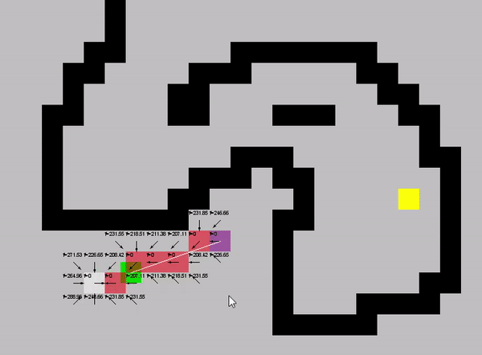

# gml-a-star-pathfinding
A set of functions demonstrating [A* Pathfinding](https://en.wikipedia.org/wiki/A*_search_algorithm) in a 2D grid array in Game Maker 8.1.

## Compatibility
Tested with `Game Maker 8.1 Standard`. Utilizes 'pro' functionality for Game Maker versions `8.1` and lower. Untested with `Game Maker Studio`.
